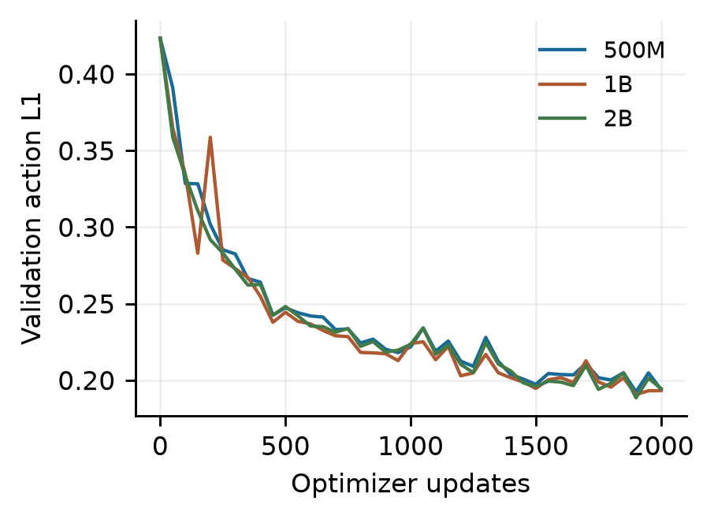

# OpenVLA distillation

Research code and measurements for **Training Budget and Student Capacity in OpenVLA Distillation**. This project studies an OpenVLA-OFT teacher and three SmolVLM-based student capacities on one LIBERO-Spatial manipulation task.

The experiment compares cumulative training budgets of 500, 1,000 and 2,000 updates. Additional updates reduce offline action error for every capacity. At 2,000 updates, all three students succeed on the same seven of eight initial states. The 500M student has lower deployment storage and warm forward latency; these results do not establish general superiority or statistical equivalence.

## Results

| Student | Updates | Validation L1 | Successes |
|---|---:|---:|---:|
| 500M | 500 | 0.247363 | 4/8 |
| 500M | 1,000 | 0.221777 | 7/8 |
| 500M | 2,000 | 0.193825 | 7/8 |
| 1B | 500 | 0.244448 | 7/8 |
| 1B | 1,000 | 0.223975 | 6/8 |
| 1B | 2,000 | 0.193264 | 7/8 |
| 2B | 500 | 0.248158 | 5/8 |
| 2B | 1,000 | 0.223460 | 7/8 |
| 2B | 2,000 | 0.194589 | 7/8 |

These are MPS evaluations of the exported CUDA-trained policies, on 80 validation observations and eight shared simulator initial states. The 72 rollouts are not independent observations of one policy. Model labels describe capacity: **1B and 2B are depth expansions of the same pretrained 500M backbone**, not separately pretrained models.



## Repository layout

- [`openvla_kd/`](openvla_kd/): original Apple Silicon data preparation, teacher cache, pilot training and closed-loop evaluator.
- [`openvla_kd_cuda/`](openvla_kd_cuda/): hardware-independent research components for CUDA training, deterministic visual pooling and FP32 master optimization.
- [`docs/REPRODUCING.md`](docs/REPRODUCING.md): public inputs, local preparation and the experimental protocol.
- [`docs/RESEARCH_SUMMARY.md`](docs/RESEARCH_SUMMARY.md): method, results, limitations and future work.
- [`results/`](results/): portable numeric results, per-state outcomes and training curves; no private execution logs or machine paths.
- [`tools/verify_results.py`](tools/verify_results.py): dependency-free consistency checks for the published result tables.

Keep the two project environments separate: both expose a package named `vla_kd`. Run commands from the relevant project directory. Do not install both into one environment and assume imports will select the intended implementation.

## Quick inspection without models or a GPU

```bash
git clone https://github.com/supermajun/OpenVLA-distillation.git
cd OpenVLA-distillation
python3 tools/verify_results.py
```

Full reproduction needs the external model/data inputs and suitable compute. This repository contains neither pretrained/student weights nor raw datasets. The existing experiments are measurements, not a promise that a fresh environment will reproduce every floating-point bit. See the reproduction guide for the exact scope of verification.

## Public release boundary

Included: model/training implementations, unit tests, dependency descriptions, pinned public input references, sanitized research measurements and generated figures. Excluded: credentials, personal accounts, private hostnames, infrastructure operation scripts, institutional instructions, personal filesystem paths, terminal/chat screenshots, private logs, local environments, downloaded upstream source and large weight/data files. The editable coursework report stays outside this public repository while author contributions are being finalized.

See [`THIRD_PARTY.md`](THIRD_PARTY.md) for upstream attribution and licensing boundaries. No new license grant is selected for the project's original code in this release.
