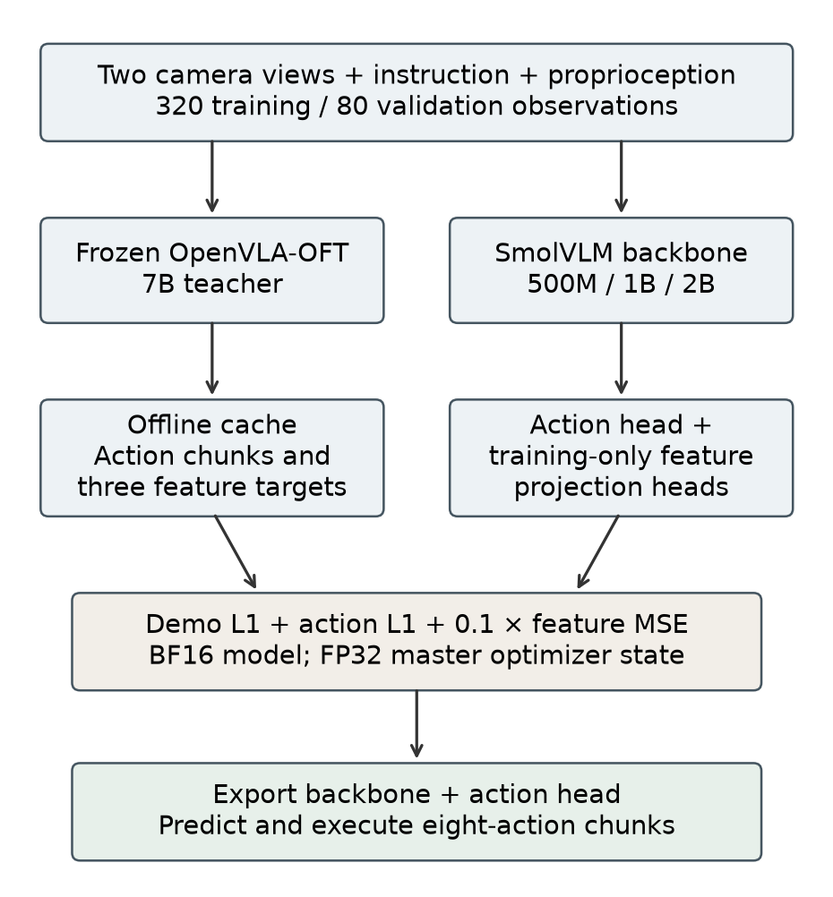
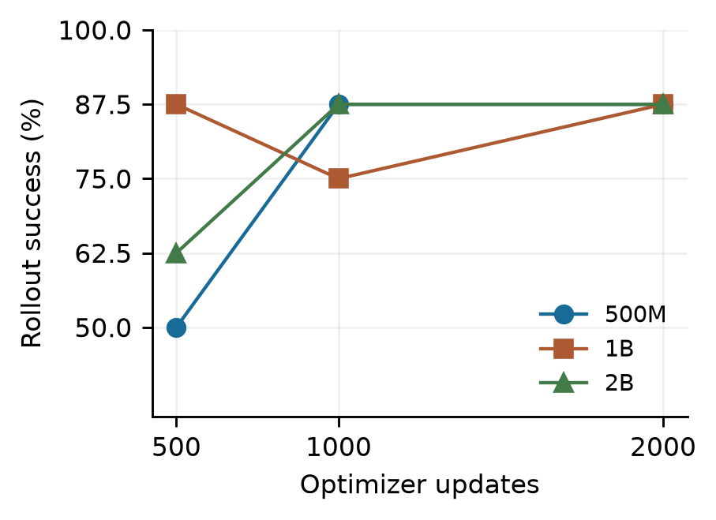
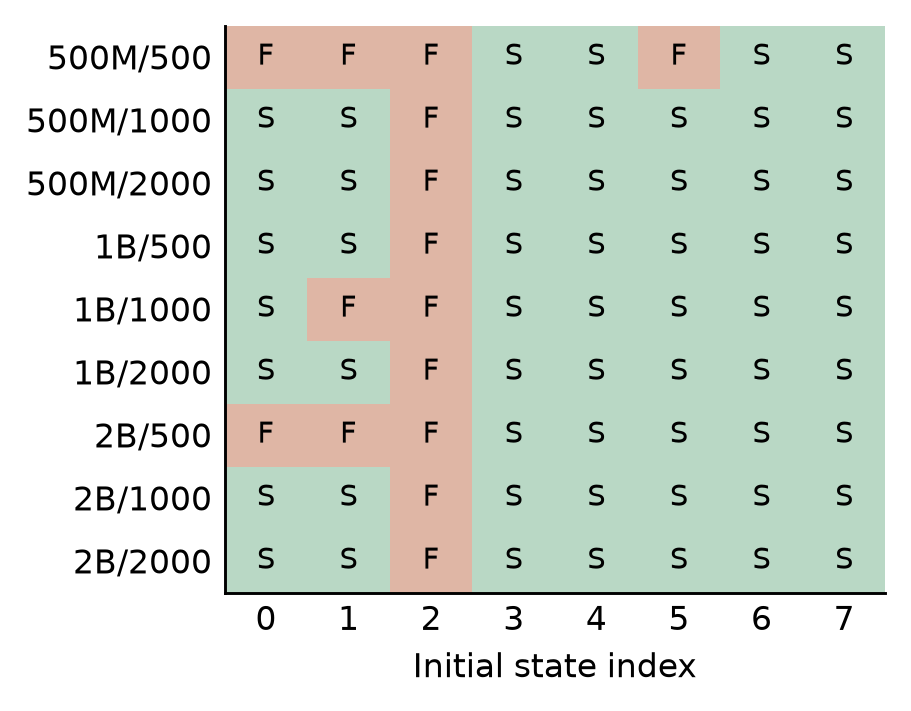
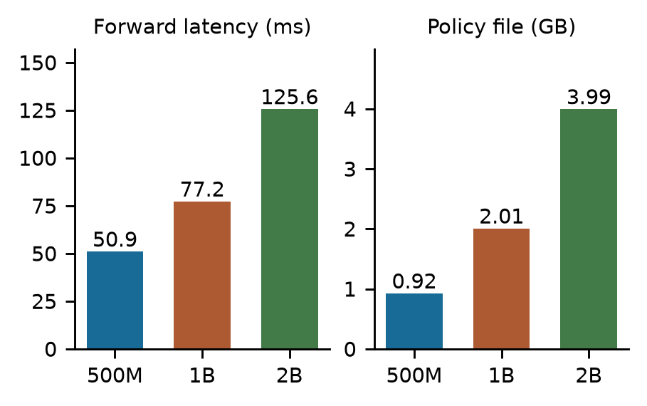

# Method, conclusions and future work

## Research question

How do student capacity and cumulative training budget affect offline action error, closed-loop task success and deployment cost in a small-data OpenVLA distillation study?

The frozen teacher is OpenVLA-OFT 7B, fine-tuned for LIBERO-Spatial. Students share a SmolVLM-500M initialization, with 32, 87 and 188 language blocks for the 500M, 1B and 2B capacity labels. Training uses demonstration action L1, cached teacher action L1 and normalized intermediate-feature MSE, weighted 1, 1 and 0.1. Feature projections are training-only and are removed from deployed policies. All student components are trainable.

The study uses 20 training demonstrations (320 observations), five validation demonstrations (80 observations), one training seed and one task: picking up the black bowl between the plate and ramekin and placing it on the plate. Nine checkpoints arise from three continuing training trajectories. They are not nine independently seeded experiments.

## Results and interpretation

The complete numeric table and per-state outcomes are in [`../results/main_results.json`](../results/main_results.json). Between 500 and 2,000 updates, exported-policy validation L1 falls by approximately 21.6% for 500M, 20.9% for 1B and 21.6% for 2B. Success counts are less regular: 500M goes 4 → 7 → 7, 1B goes 7 → 6 → 7, and 2B goes 5 → 7 → 7, each out of eight.

At 2,000 updates all capacities succeed on the same seven states and fail on state 2. Equal observed rates do not establish statistical equivalence. A 7/8 success estimate has an approximate 95% Wilson interval of 52.9%–97.8%, and the fixed development-state selection further limits population inference. The paired 500M gain from 4/8 to 7/8 contains three improvements and no regressions; its descriptive exact two-sided paired-binomial p-value is 0.25. There is no strong significance claim from these eight states.

At 2,000 updates, warm forward latencies are about 50.9, 77.2 and 125.6 ms for 500M, 1B and 2B on the measured MPS setup. Policy files are about 0.92, 2.01 and 3.99 GB (decimal). These values exclude image preprocessing and simulator/control work. The 500M model is therefore the lowest-cost candidate among the measured policies with the final observed success count, not a universally best model.

## What is and is not established

- More updates improve the measured offline error across all three capacities within the tested budgets.
- Lower offline error does not guarantee another successful rollout, as the 1B middle checkpoint and final success plateau illustrate.
- The experiment does not isolate a causal benefit of distillation over demonstration-only training at the main budget. The early objective ablation used a different, smaller data/training budget.
- The larger students are depth expansions of a shared pretrained model; findings cannot be transferred directly to independently pretrained 1B/2B families.
- One seed, one task, eight repeatedly inspected initial states and shared teacher knowledge restrict generalization claims. No full LIBERO suite or real-robot benchmark is reported.
- The same failed state across policies identifies a useful diagnostic case. Images alone do not establish whether perception, grasp timing, action prediction or recovery is responsible.

## Future work

1. Evaluate additional predefined initial states, multiple training seeds and more tasks while preserving paired comparisons between policies. Reserve an untouched final test set after checkpoint selection.
2. Compare demonstration-only, action-only distillation, feature-only distillation and the combined objective under the same data, precision and update budgets. Separately ablate feature weight/location and optimizer precision.
3. Inspect synchronized camera frames, gripper commands and object trajectories for state 2. Collect recovery examples or teacher actions on student-visited states; evaluate fixes on additional held-out states rather than only the known failure.
4. Test shorter action execution chunks to study feedback frequency versus inference cost. Measure complete control-loop latency, memory transients and energy or compute cost.
5. Compare independently pretrained student families and broader LIBERO suites before extending to real robots.

The contribution is a reproducible experimental pipeline and a bounded empirical comparison. The evidence favors investigating training budget and data/feedback limitations before assuming that more student parameters will improve this task.
